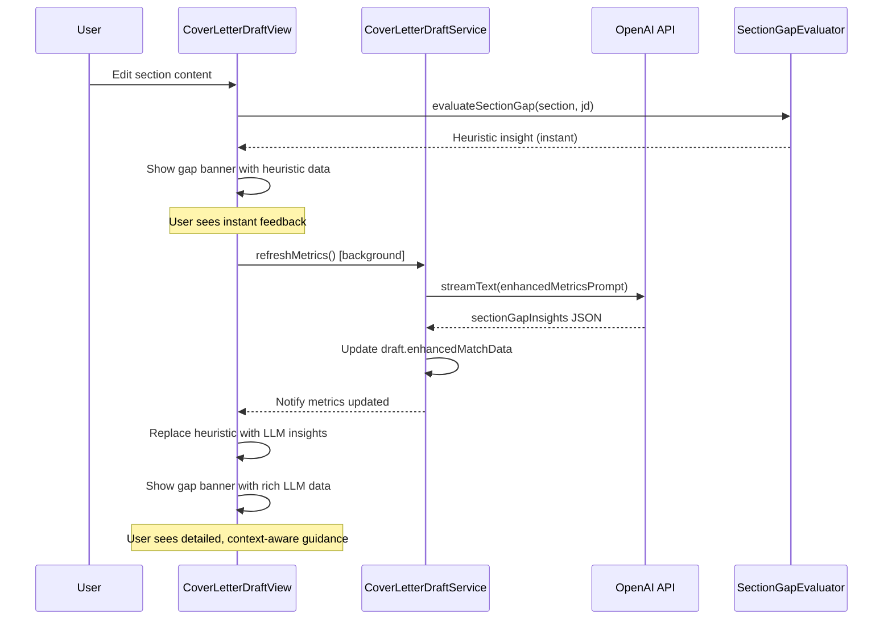

# Content Card Requirement Tags - Improvement Plan

**Status:** 📋 Ready for Agent Handoff  
**Priority:** HIGH - Critical bug + UX improvements  
**Estimated Effort:** 5-6 hours (6 independent tasks)  
**Dependencies:** None - can start immediately  

---

## Problem Statement

**Current Issue:** Requirement tags on content cards show ALL met requirements on EVERY section, instead of showing which requirements each specific section addresses.

**Expected Behavior:** Each section should dynamically display only the requirements it demonstrates, based on `enhancedMatchData.coreRequirementDetails` and `preferredRequirementDetails` with proper `sectionIds` filtering.

---

## Current vs. Target Architecture

### **Current (Buggy):**
```
Introduction Card:
  Tags: [ALL met requirements across entire draft]
  
Experience Card:
  Tags: [ALL met requirements across entire draft] ← DUPLICATE
  
Closing Card:
  Tags: [ALL met requirements across entire draft] ← DUPLICATE
```

### **Target (Correct):**
```
Introduction Card:
  Tags: ["5+ Years Experience", "Strong Communication Skills"]
  ↑ Only requirements demonstrated in THIS section
  
Experience Card:
  Tags: ["Bachelor's Degree", "Data-Driven Decision Making", "Cross-Functional Management"]
  ↑ Only requirements demonstrated in THIS section
  
Closing Card:
  Tags: ["Enthusiasm for Role", "Company Alignment"]
  ↑ Only requirements demonstrated in THIS section
```

---

## Data Flow

### **1. Source Data Structure:**
```typescript
enhancedMatchData = {
  coreRequirementDetails: [
    {
      id: "core-0",
      requirement: "5+ years PM experience",
      demonstrated: true,  // ← Is this requirement met in the draft?
      evidence: "Mentioned 'several years' in Introduction",
      sectionIds: ["introduction"], // ← WHICH sections address this?
      severity: "critical"
    },
    {
      id: "core-1",
      requirement: "Bachelor's Degree",
      demonstrated: true,
      evidence: "Education mentioned in Experience section",
      sectionIds: ["experience"],
      severity: "critical"
    },
    {
      id: "core-2",
      requirement: "SQL proficiency",
      demonstrated: false, // ← NOT met (will show in Match component gaps, not as tag)
      evidence: "Not mentioned in draft",
      sectionIds: [],
      severity: "important"
    }
  ],
  preferredRequirementDetails: [
    {
      id: "pref-0",
      requirement: "AI/ML experience",
      demonstrated: true,
      evidence: "Highlighted in Experience section",
      sectionIds: ["experience"],
      severity: "nice-to-have"
    }
  ]
};
```

### **2. Current Buggy Logic (Line 103-119 in CoverLetterDraftView.tsx):**
```typescript
const getRequirementsForParagraph = (paragraphType: string) => {
  if (enhancedMatchData) {
    const allReqs = [
      ...enhancedMatchData.coreRequirementDetails,
      ...enhancedMatchData.preferredRequirementDetails
    ];
    
    // ❌ BUG: Filters by demonstrated, but NOT by sectionIds
    const sectionReqs = allReqs
      .filter(req => req.demonstrated) // Only met requirements
      .map(req => req.requirement);   // Returns ALL met requirements
    
    return sectionReqs; // Same array for every section!
  }
  
  // Fallback...
};
```

### **3. Fixed Logic:**
```typescript
const getRequirementsForParagraph = (paragraphType: string) => {
  if (enhancedMatchData) {
    const allReqs = [
      ...(enhancedMatchData.coreRequirementDetails || []),
      ...(enhancedMatchData.preferredRequirementDetails || [])
    ];
    
    // ✅ FIX: Filter by BOTH demonstrated AND sectionIds
    const sectionReqs = allReqs
      .filter(req => {
        // Must be demonstrated (met)
        if (!req.demonstrated) return false;
        
        // Must be addressed in THIS specific section
        const sectionIds = req.sectionIds || [];
        return sectionIds.includes(paragraphType);
      })
      .map(req => req.requirement);
    
    return sectionReqs; // Only requirements for THIS section
  }
  
  // Fallback for sections without enhancedMatchData
  return getDefaultTagsForSection(paragraphType);
};
```

---

## Implementation Plan

### **Task 1: Fix Tag Filtering Bug** 🔴 CRITICAL
**File:** `src/components/cover-letters/CoverLetterDraftView.tsx`

**Changes:**
1. Update `getRequirementsForParagraph` to filter by `sectionIds`
2. Ensure `demonstrated: true` AND `sectionIds.includes(paragraphType)` both checked
3. Handle edge cases:
   - Empty `sectionIds` array
   - Missing `enhancedMatchData`
   - Section type mismatches (e.g., "intro" vs "introduction")

**Acceptance Criteria:**
- [ ] Each section shows only requirements it addresses
- [ ] No duplicate tags across sections
- [ ] Tags appear dynamically based on LLM analysis
- [ ] Fallback gracefully if `enhancedMatchData` is missing

---

### **Task 2: Improve Tag Visual Hierarchy** 🎨
**File:** `src/components/shared/ContentCard.tsx` (likely)

**Changes:**
1. **Add severity-based styling:**
   - Core requirements (critical): Green/primary badge
   - Preferred requirements (nice-to-have): Blue/secondary badge

2. **Data structure update:**
   ```typescript
   // Instead of simple string array:
   tags: string[]
   
   // Pass structured tag objects:
   tags: Array<{
     label: string;
     type: 'core' | 'preferred';
     severity: 'critical' | 'important' | 'nice-to-have';
   }>
   ```

3. **Update `getRequirementsForParagraph` to return structured data:**
   ```typescript
   const sectionReqs = allReqs
     .filter(req => req.demonstrated && req.sectionIds?.includes(paragraphType))
     .map(req => ({
       label: req.requirement,
       type: req.id.startsWith('core-') ? 'core' : 'preferred',
       severity: req.severity || 'important'
     }));
   ```

4. **Render badges with appropriate styling:**
   ```tsx
   {tags.map(tag => (
     <Badge 
       key={tag.label}
       variant={tag.type === 'core' ? 'default' : 'secondary'}
       className={cn(
         tag.type === 'core' && 'bg-green-100 text-green-800 border-green-300',
         tag.type === 'preferred' && 'bg-blue-100 text-blue-800 border-blue-300'
       )}
     >
       {tag.label}
     </Badge>
   ))}
   ```

**Acceptance Criteria:**
- [ ] Core requirements have distinct visual style (green)
- [ ] Preferred requirements have distinct visual style (blue)
- [ ] Severity is accessible via data attribute (for future use)
- [ ] Backward compatible with simple string arrays (fallback)

---

### **Task 3: Add Interactive Tooltips** 💡
**Files:** 
- `src/components/shared/ContentCard.tsx`
- `src/components/cover-letters/RequirementTagTooltip.tsx` (new)

**Changes:**
1. **Create `RequirementTagTooltip` component:**
   ```tsx
   interface RequirementTagTooltipProps {
     requirement: string;
     evidence: string;
     type: 'core' | 'preferred';
     severity: string;
   }
   
   export function RequirementTagTooltip({ 
     requirement, 
     evidence, 
     type, 
     severity 
   }: RequirementTagTooltipProps) {
     return (
       <TooltipContent className="max-w-sm">
         <div className="space-y-2">
           <div className="flex items-center gap-2">
             <Badge variant={type === 'core' ? 'default' : 'secondary'}>
               {type === 'core' ? 'Core' : 'Preferred'}
             </Badge>
             <span className="text-xs text-muted-foreground">
               {severity}
             </span>
           </div>
           
           <p className="text-sm font-medium">{requirement}</p>
           
           <div className="text-xs text-muted-foreground">
             <p className="font-medium mb-1">How you address this:</p>
             <p className="italic">"{evidence}"</p>
           </div>
         </div>
       </TooltipContent>
     );
   }
   ```

2. **Update `getRequirementsForParagraph` to return full requirement objects:**
   ```typescript
   const sectionReqs = allReqs
     .filter(req => req.demonstrated && req.sectionIds?.includes(paragraphType))
     .map(req => ({
       id: req.id,
       label: req.requirement,
       evidence: req.evidence,
       type: req.id.startsWith('core-') ? 'core' : 'preferred',
       severity: req.severity || 'important'
     }));
   ```

3. **Render tags with tooltips in ContentCard:**
   ```tsx
   {tags.map(tag => (
     <Tooltip key={tag.id || tag.label}>
       <TooltipTrigger asChild>
         <Badge 
           variant={tag.type === 'core' ? 'default' : 'secondary'}
           className="cursor-help"
         >
           {tag.label}
         </Badge>
       </TooltipTrigger>
       
       <RequirementTagTooltip 
         requirement={tag.label}
         evidence={tag.evidence}
         type={tag.type}
         severity={tag.severity}
       />
     </Tooltip>
   ))}
   ```

**Acceptance Criteria:**
- [ ] Hovering over tag shows tooltip with requirement details
- [ ] Tooltip displays evidence text showing how requirement is addressed
- [ ] Tooltip shows requirement type (core/preferred) and severity
- [ ] Tooltip is accessible (keyboard navigable)
- [ ] Tooltip doesn't interfere with gap banners or edit actions

---

### **Task 4: Section Type Normalization** 🔧
**File:** `src/components/cover-letters/CoverLetterDraftView.tsx`

**Problem:** LLM might return `sectionIds: ["intro"]` but UI uses `section.type: "introduction"`

**Changes:**
1. **Create section type mapper:**
   ```typescript
   const normalizeSectionType = (sectionType: string): string[] => {
     // Map common variations to canonical forms
     const aliases: Record<string, string[]> = {
       'introduction': ['introduction', 'intro', 'opening'],
       'experience': ['experience', 'exp', 'background'],
       'closing': ['closing', 'conclusion', 'signature'],
       'body': ['body', 'paragraph', 'content']
     };
     
     // Find canonical type
     for (const [canonical, variations] of Object.entries(aliases)) {
       if (variations.includes(sectionType.toLowerCase())) {
         return [canonical, ...variations];
       }
     }
     
     return [sectionType.toLowerCase()];
   };
   ```

2. **Update filtering logic:**
   ```typescript
   const sectionReqs = allReqs
     .filter(req => {
       if (!req.demonstrated) return false;
       
       const sectionIds = req.sectionIds || [];
       const normalizedTypes = normalizeSectionType(paragraphType);
       
       // Check if ANY normalized variation matches
       return sectionIds.some(id => 
         normalizedTypes.includes(id.toLowerCase())
       );
     })
     .map(req => ({ ... }));
   ```

**Acceptance Criteria:**
- [ ] "intro" in sectionIds matches "introduction" section.type
- [ ] "exp" in sectionIds matches "experience" section.type
- [ ] Handles case-insensitive matching
- [ ] Extensible for future section types

---

### **Task 5: Empty State Handling** 🎯
**File:** `src/components/cover-letters/CoverLetterDraftView.tsx`

**Scenario:** Section has no requirements addressed (e.g., closing paragraph)

**Changes:**
1. **Update ContentCard to handle empty tags gracefully:**
   ```typescript
   const requirements = getRequirementsForParagraph(section.type);
   const showTags = requirements.length > 0;
   
   <ContentCard
     title={sectionTitle}
     tags={showTags ? requirements : undefined} // Hide tag section if empty
     tagsLabel={showTags ? "Job Requirements" : undefined}
     // ... rest of props
   />
   ```

2. **OR show subtle empty state:**
   ```tsx
   <ContentCard
     tags={requirements.length > 0 ? requirements : undefined}
     emptyTagsMessage={requirements.length === 0 ? "No requirements addressed in this section" : undefined}
   />
   ```

**Acceptance Criteria:**
- [ ] Sections without requirements don't show empty tag area
- [ ] No visual clutter from empty states
- [ ] Clear when a section intentionally addresses no requirements (e.g., signature)

---

### **Task 6: Update LLM Prompt (If Needed)** 📝
**File:** `src/prompts/enhancedMetricsAnalysis.ts`

**Verify:**
- [ ] Prompt instructs LLM to populate `sectionIds` for all requirements
- [ ] Section ID format matches UI section types
- [ ] Examples show multiple sectionIds for requirements addressed in multiple sections

**Example addition to prompt:**
```typescript
IMPORTANT: For each requirement in coreRequirementDetails and preferredRequirementDetails:
- Set "demonstrated": true only if the requirement is addressed in the draft
- Populate "sectionIds" with the slug(s) of sections where this requirement is demonstrated
  Available section slugs: ["introduction", "experience", "closing", "signature"]
- If a requirement is addressed in multiple sections, include all relevant slugs
- If not addressed, leave sectionIds as empty array []

Example:
{
  "requirement": "5+ years PM experience",
  "demonstrated": true,
  "evidence": "Mentioned in both introduction ('several years') and experience section (detailed 8-year tenure)",
  "sectionIds": ["introduction", "experience"] // Multiple sections!
}
```

---

## Testing Plan

### **Unit Tests:**
1. `getRequirementsForParagraph` returns correct tags for each section
2. `normalizeSectionType` handles aliases correctly
3. Empty requirements array doesn't break rendering

### **Integration Tests:**
1. Create draft with Supio JD → verify tags appear on correct sections
2. Hover over tag → verify tooltip shows evidence
3. Section with no requirements → verify no tags shown
4. Core vs preferred requirements → verify different badge colors

### **Manual QA Checklist:**
- [ ] Introduction section shows only its requirements
- [ ] Experience section shows only its requirements
- [ ] No duplicate tags across sections
- [ ] Core requirements have green badges
- [ ] Preferred requirements have blue badges
- [ ] Tooltips show requirement type, severity, and evidence
- [ ] Empty sections don't show tag UI
- [ ] Tags update dynamically if draft is re-analyzed

---

## Implementation Order

1. **Task 1 (Fix Bug)** - 1 hour - CRITICAL, blocks accurate UX
2. **Task 4 (Section Normalization)** - 30 min - Prevents edge case bugs
3. **Task 5 (Empty State)** - 30 min - Polish before adding visual features
4. **Task 2 (Visual Hierarchy)** - 1 hour - Makes tags more informative
5. **Task 3 (Tooltips)** - 1.5 hours - Adds interactivity
6. **Task 6 (LLM Prompt)** - 30 min - Ensure data quality from source

**Total:** ~5-6 hours for complete tag system improvement

---

## Success Metrics

- [ ] **Accuracy:** Each section shows only requirements it addresses (no duplicates)
- [ ] **Clarity:** Core vs preferred requirements visually distinct
- [ ] **Discoverability:** Users can hover to understand how requirement is met
- [ ] **Performance:** No additional LLM calls; all data from cached `enhancedMatchData`
- [ ] **Consistency:** Tags match with Match component metrics and gap banners

---

## Future Enhancements (Out of Scope for MVP)

- Click tag to highlight the specific text that addresses it (text search/scroll)
- Drag-and-drop tags to different sections to reassign evidence
- Toggle view: "Show all requirements" vs "Show only this section's requirements"
- Export requirements coverage report (which sections address which requirements)

---

## Quick Start for Agent

1. **Read this entire plan** (understand data flow and architecture)
2. **Start with Task 1** (fix filtering bug - CRITICAL)
3. **Verify with test:** Create Supio draft → check Introduction tags ≠ Experience tags
4. **Then proceed to Tasks 2-6** in order (each builds on previous)
5. **Test after each task** using manual QA checklist
6. **Commit after completing all 6 tasks** (atomic feature)

**Key Files:**
- `src/components/cover-letters/CoverLetterDraftView.tsx` (main logic - line 103)
- `src/components/shared/ContentCard.tsx` (rendering)
- `src/prompts/enhancedMetricsAnalysis.ts` (LLM prompt validation)

**Questions?** All implementation details, code examples, and edge cases are documented in the tasks above. The plan is comprehensive and ready to execute.

---

## Section-Specific Gap Insights (Agent C, D & E)

### Overview
Cover letter sections now receive **section-specific gap insights** instead of global gaps. This provides targeted guidance for introduction, experience, closing, and signature sections.

### Data Contract

#### Type Definition
```typescript
interface SectionGapInsight {
  sectionSlug: string;
  sectionType: 'introduction' | 'experience' | 'closing' | 'signature' | 'custom';
  sectionTitle?: string;
  promptSummary: string; // Rubric guidance for the section
  requirementGaps: Array<{
    id: string;
    label: string; // Short title (e.g., "Missing quantified impact")
    severity: 'high' | 'medium' | 'low';
    requirementType?: 'core' | 'preferred' | 'differentiator' | 'narrative';
    rationale: string; // Why this is a gap
    recommendation: string; // How to fix it
  }>;
  recommendedMoves: string[]; // Quick actions (e.g., "Add metrics")
  nextAction?: string; // Primary CTA
}
```

#### Backend → Frontend Flow
1. **Draft Generation:** Backend creates `enhancedMatchData.sectionGapInsights` during metrics calculation
2. **Structure:** Array of `SectionGapInsight` objects, one per section
3. **Frontend Consumption:** `CoverLetterDraftView` calls `getSectionGapInsights(sectionId, sectionType)`
4. **Display:** `ContentCard` renders gap banner with `promptSummary` and structured gaps

### Flow Diagram



### Priority Fallback Logic

```typescript
function getSectionGapInsights(sectionId: string, sectionType: string) {
  // Priority 1: LLM insights (most accurate)
  if (enhancedMatchData?.sectionGapInsights) {
    const insight = enhancedMatchData.sectionGapInsights.find(
      i => i.sectionSlug === sectionType
    );
    if (insight) return { ...insight, isLoading: false };
  }

  // Priority 2: Heuristic insights (fast, immediate)
  if (pendingSectionInsights[sectionId]) {
    return { 
      ...pendingSectionInsights[sectionId], 
      isLoading: true // Indicates LLM refresh pending
    };
  }

  // Priority 3: Legacy fallback (global unmet requirements)
  if (enhancedMatchData?.coreRequirementDetails) {
    const unmetReqs = [
      ...enhancedMatchData.coreRequirementDetails.filter(r => !r.demonstrated),
      ...enhancedMatchData.preferredRequirementDetails.filter(r => !r.demonstrated)
    ];
    return {
      promptSummary: null,
      gaps: unmetReqs.map(r => ({ id: r.id, title: r.requirement, description: r.evidence })),
      isLoading: false
    };
  }

  // No insights available
  return { promptSummary: null, gaps: [], isLoading: true };
}
```

### Adding New Section Types

To add support for a new section type (e.g., "portfolio-showcase"):

1. **Update `SectionGapInsight['sectionType']` in `types/coverLetters.ts`:**
   ```typescript
   sectionType: 'introduction' | 'experience' | 'closing' | 'signature' | 'portfolio-showcase' | 'custom';
   ```

2. **Add heuristic evaluation in `lib/coverLetters/sectionGapHeuristics.ts`:**
   ```typescript
   function evaluatePortfolioShowcase(section, jd): SectionGapInsight['requirementGaps'] {
     const gaps = [];
     
     // Check for portfolio link
     if (!section.content.match(/https?:\/\//)) {
       gaps.push({
         id: 'portfolio-no-link',
         label: 'No portfolio link provided',
         severity: 'high',
         requirementType: 'core',
         rationale: 'Portfolio section should include a clickable link',
         recommendation: 'Add your portfolio URL (e.g., https://yourportfolio.com)'
       });
     }
     
     return gaps;
   }
   ```

3. **Update `normalizeSectionType()` in `CoverLetterDraftView.tsx`:**
   ```typescript
   const aliases: Record<string, string[]> = {
     // ... existing aliases
     'portfolio-showcase': ['portfolio-showcase', 'portfolio', 'work-samples'],
   };
   ```

4. **Update LLM prompt in `prompts/enhancedMetricsAnalysis.ts`:**
   - Add rubric guidance for portfolio section
   - Include examples of portfolio-specific gaps

### Known Limitations

- **Custom sections:** Sections with `type: 'custom'` fall back to generic "experience" rubric
- **Single-word sections:** Sections with <50 characters may not receive accurate heuristic analysis
- **Real-time updates:** Heuristic insights update after 1-2 second debounce (not keystroke-by-keystroke)
- **LLM latency:** Full LLM refresh can take 5-15 seconds depending on draft length

### Test Fixtures

Mock data for testing and design work is available in:
- **File:** `tests/fixtures/mockSectionGapInsights.json`
- **Scenarios:** Complete (all gaps), heuristic-only, minimal, no gaps, edge cases
- **Usage:** Import in component tests, Storybook stories, and E2E tests

### QA & Documentation

For comprehensive testing matrix, regression checklist, and E2E scenarios, see:
- **File:** `QA_DOCUMENTATION_PLAN.md`
- **Coverage:** Happy path, fallback mode, edit flow, edge cases, tooling


